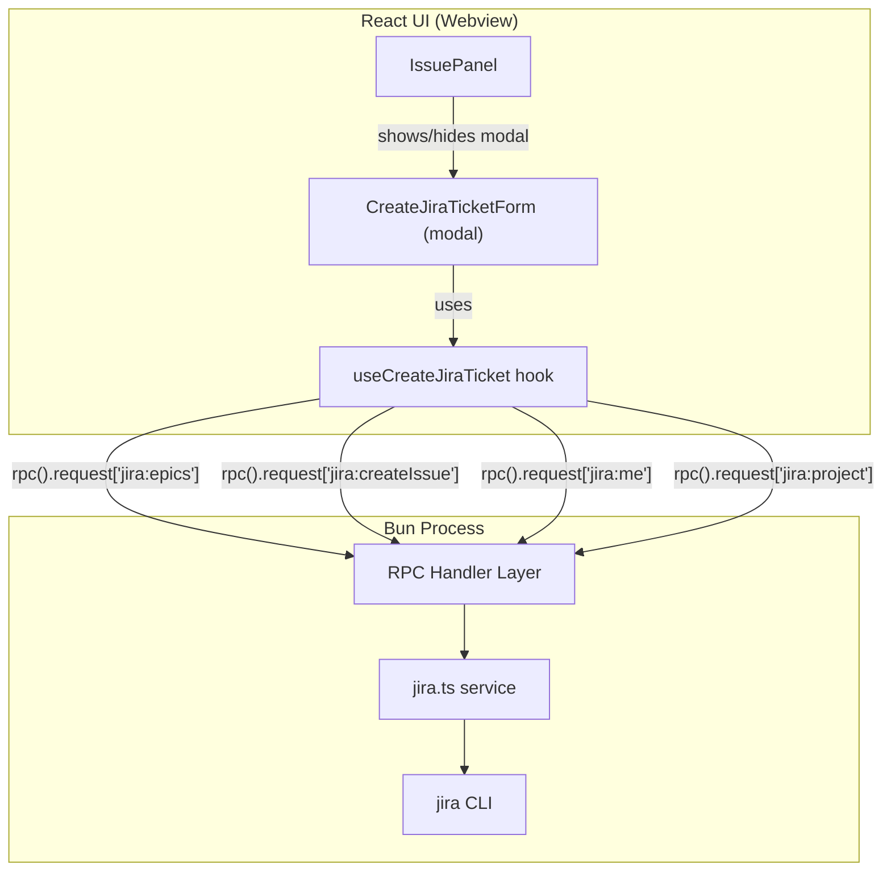

# Design Document: Jira Ticket Creation

## Overview

This feature adds a Jira ticket creation modal dialog to the Mossy desktop app. Users trigger the form via a "+" icon button in the Issue Panel header; the form opens as a centered modal overlay. The form collects a summary and optional parent epic, then creates a "User Story" ticket via the `jira` CLI. On success, the modal closes immediately and the issue list refreshes after a 2-second delay to allow Jira indexing.

The design builds on the existing patterns in Mossy:
- The Bun process hosts Jira CLI interactions (like the existing `getMyJiraIssues` / `getJiraIssue` functions).
- The React UI communicates with Bun via Electrobun RPC.
- State lives in React hooks that call RPC methods and manage loading/error state.

## Architecture



The form renders inside a `fixed inset-0` modal overlay managed by `IssuePanel`. A boolean state (`showCreateForm`) in `IssuePanel` toggles the modal on/off. Backdrop clicks do NOT close the modal — only the Cancel button or Escape key trigger the close flow.

> **Note:** The `jira:issueTypes` RPC endpoint still exists in the backend but is unused by the frontend. The issue type is hardcoded to "User Story".

## Components and Interfaces

### Component: `CreateJiraTicketForm`

A self-contained React component rendered inside a modal overlay managed by `IssuePanel`.

**Props:**
```typescript
interface CreateJiraTicketFormProps {
  onClose: () => void       // close the modal
  onCreated: () => void     // signal successful creation (triggers delayed refresh)
}
```

**Rendering details:**
- Rendered within a modal container with `min-h-[320px]` and `overflow-visible`
- The modal overlay has `role="dialog"`, `aria-modal="true"`, and `aria-labelledby="create-jira-ticket-title"`
- Escape key calls `handleCancel` (respects dirty-state confirmation)
- Issue type is hardcoded to "User Story" — no work type selector is rendered

**Responsibilities:**
- Renders Summary input and Parent Epic searchable dropdown
- Displays resolved project name and assignee (read-only)
- Displays error banners for authentication/config errors inside the form
- Handles form validation (summary checked on submit; inline error clearing)
- Manages dirty-state tracking for the cancel-confirmation flow
- Delegates all Jira communication to the `useCreateJiraTicket` hook

### Component: `IssuePanel` (modified)

Existing component gains:
- A "+" button in the header (visible only when `issueTracker === 'jira'`)
- A `showCreateForm` state that toggles the modal overlay
- A `timerRef` for the 2-second delayed refresh on successful creation, with cleanup on unmount
- The modal is rendered as a `fixed inset-0` overlay with `bg-black/80` backdrop
- Backdrop click does NOT close the modal (no `onClick` handler on the backdrop)
- `handleCreated` callback: closes modal immediately, then triggers `onRefresh()` after a 2-second `setTimeout`

### Hook: `useCreateJiraTicket`

Encapsulates all async state for the creation form.

```typescript
interface UseCreateJiraTicketReturn {
  epics: JiraEpic[]
  epicsLoading: boolean

  currentUser: string | null
  currentUserError: string | null

  projectKey: string | null
  projectError: string | null

  // Submission
  submit: (params: CreateJiraIssueParams) => Promise<CreateJiraIssueResult>
  submitting: boolean
}

interface JiraEpic {
  key: string
  summary: string
}

interface CreateJiraIssueParams {
  /** Currently always 'User Story' */
  issueType: string
  summary: string
  epicKey?: string
}

interface CreateJiraIssueResult {
  success: boolean
  issueKey?: string
  error?: string
}
```

The hook calls RPC endpoints on mount to pre-fetch epics, current user, and project. It exposes a `submit` function that calls `jira:createIssue`.

## Data Models

### Shared types (in `src/shared/types.ts`)

```typescript
export interface JiraEpic {
  key: string
  summary: string
}

export interface CreateJiraIssueParams {
  /** Currently always 'User Story' — kept as string for future flexibility */
  issueType: string
  summary: string
  epicKey?: string
}

export interface CreateJiraIssueResult {
  success: boolean
  issueKey?: string
  error?: string
}
```

### RPC endpoints (in `MossyRPC`)

```typescript
'jira:issueTypes': {
  params: Record<string, never>
  response: { types: string[] } | { error: string }
}
// Note: jira:issueTypes still exists but is unused by the frontend

'jira:epics': {
  params: Record<string, never>
  response: { epics: JiraEpic[] } | { error: string }
}
'jira:me': {
  params: Record<string, never>
  response: { user: string } | { error: string }
}
'jira:project': {
  params: Record<string, never>
  response: { projectKey: string } | { error: string }
}
'jira:createIssue': {
  params: CreateJiraIssueParams
  response: CreateJiraIssueResult
}
```

### Jira service functions (in `src/bun/services/jira.ts`)

| Function | CLI command | Notes |
|----------|------------|-------|
| `getJiraEpics()` | `jira epic list --raw` | Returns `JiraEpic[]` (max 50). Filters out completed epics using `DONE_STATUSES` set (done, closed, resolved, completed, cancelled, canceled, rejected). |
| `getJiraCurrentUser()` | `jira me` | Returns `string` (account ID / email). |
| `getJiraProject()` | Reads `~/.config/.jira/.config.yml` `project` field | Returns project key from config. Uses shared `readJiraConfig()` helper. |
| `createJiraIssue(params)` | `jira issue create -t{type} -s{summary} [-a{user}] [-P{epicKey}]` | Does NOT pass an explicit project flag (relies on CLI config). Assignee (`-a`) is best-effort: if `jira me` fails, the ticket is created without it. Summary has newlines/tabs replaced with spaces before submission. |

A shared `readJiraConfig()` helper is used by both `getJiraBaseUrl()` and `getJiraProject()` to DRY up config file reading.

Each function follows the existing pattern: spawn the `jira` CLI with the shell env from `getShellEnv()`, apply a timeout (15s for metadata, 30s for creation), parse stdout, and return typed results or error strings.

### Form validation utilities (in `src/utils/jira-form-validation.ts`)

```typescript
interface FormState {
  summary: string
  epicKey: string | null
}

function validateSummary(value: string): string | null
function trimSummary(value: string): string
function truncateTo255(value: string): string
function validateForm(fields: { summary: string }): Record<string, string>
function isDirty(current: FormState, defaults: FormState): boolean
```

### Epic filtering utility (in `src/utils/jira-epic-filter.ts`)

```typescript
function filterEpics(epics: JiraEpic[], query: string): JiraEpic[]
```

## Correctness Properties

*A property is a characteristic or behavior that should hold true across all valid executions of a system — essentially, a formal statement about what the system should do.*

### Property 1: Whitespace-only summaries are always rejected

*For any* string composed entirely of whitespace characters (spaces, tabs, newlines), the form validation SHALL reject submission and the Jira CLI SHALL never be invoked.

**Validates: Requirements 4.2, 8.1**

### Property 2: Summary length enforcement

*For any* input string longer than 255 UTF-8 characters, the form SHALL prevent entry beyond 255 characters and SHALL display the character count indicator.

**Validates: Requirements 4.3, 4.5**

### Property 3: Summary whitespace trimming

*For any* valid summary string with leading or trailing whitespace, the value sent to the Jira CLI SHALL equal the original string with leading and trailing whitespace removed.

**Validates: Requirements 4.4**

### Property 4: Epic filter correctness

*For any* list of epics and any search query string, the filtered result SHALL contain only epics where the key or summary contains the query as a case-insensitive substring, and SHALL contain all such epics.

**Validates: Requirements 5.5**

### Property 5: Validation displays all errors simultaneously

*For any* combination of invalid field states (empty or over-length summary), clicking "Create" SHALL produce validation messages for every invalid field, not just the first.

**Validates: Requirements 8.1**

### Property 6: Dirty-state detection for cancel confirmation

*For any* form state where at least one field differs from its default value (`summary: ''`, `epicKey: null`), clicking "Cancel" SHALL trigger a confirmation prompt. For any form state where all fields equal their defaults, clicking "Cancel" SHALL close immediately.

**Validates: Requirements 2.3, 2.4**

## Error Handling

| Scenario | User-visible behavior |
|----------|----------------------|
| Epics fetch fails | Epic dropdown shown empty; user can proceed without epic |
| `jira me` fails | Warning banner "Could not determine Jira user" displayed in form; ticket still creates without assignee (best-effort) |
| Project key not found in config | Error banner "Jira project not configured" displayed in form; "Create" button disabled |
| Ticket creation fails (CLI error) | Error banner inside form with CLI message; form data preserved; controls re-enabled |
| Ticket creation times out (30s) | Timeout error displayed; form data preserved; controls re-enabled |
| Modal dismissed via Escape | Triggers dirty-state cancel flow (confirmation if dirty, immediate close if clean) |

All errors from the Bun process are returned as typed `{ error: string }` responses rather than thrown exceptions, following the existing pattern in the Jira service.

## Testing Strategy

### Unit Tests

- **Form validation logic** (`jira-form-validation.test.ts`): test that empty/whitespace summaries are rejected, max-length is enforced, trim is applied before submission.
- **Epic filtering** (`jira-epic-filter.test.ts`): test case-insensitive substring matching on key + summary.
- **Dirty-state detection**: test that modifications to any field from default correctly flag form as dirty.
- **Component rendering**: test that "+" button only appears for `jira` tracker.

### Property-Based Tests

Property-based testing is appropriate for this feature because the form validation and filtering logic are pure functions with well-defined input/output behavior.

**Library:** [fast-check](https://github.com/dubzzz/fast-check) (TypeScript PBT library, commonly used with Bun test runner)

**Configuration:**
- Minimum 100 iterations per property test
- Each test tagged with: **Feature: jira-ticket-creation, Property {number}: {property_text}**

Tests to implement:
1. Property 1 — Generate arbitrary whitespace strings → assert validation rejects
2. Property 2 — Generate strings > 255 UTF-8 chars → assert truncation and counter display
3. Property 3 — Generate valid summaries with leading/trailing whitespace → assert trim
4. Property 4 — Generate random epic lists and query strings → assert filter correctness
5. Property 5 — Generate random combinations of invalid field values → assert all errors shown
6. Property 6 — Generate field state permutations → assert dirty detection

### Integration / RPC Tests

- **`jira-rpc.test.ts`**: End-to-end RPC response shape tests with mocked CLI spawns using `spyOn(Bun, 'spawn')` pattern. Verifies correct arguments passed to CLI and response contracts.
- **`jira-service.test.ts`**: Service-level unit tests for `getJiraEpics`, `createJiraIssue` with `createMockProc` helper for simulating subprocess behavior.
- All tests are fully mocked (no real CLI calls).
- Tests verify: epic capping at 50, assignee best-effort (no `-a` flag when `jira me` fails), no `-p` project flag passed, `-P` epic flag only when provided.
